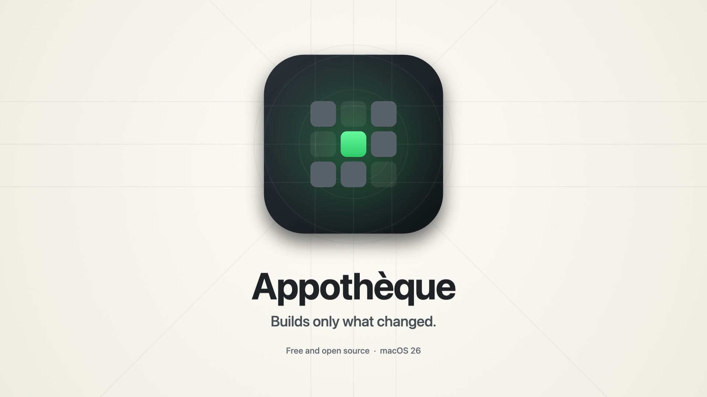
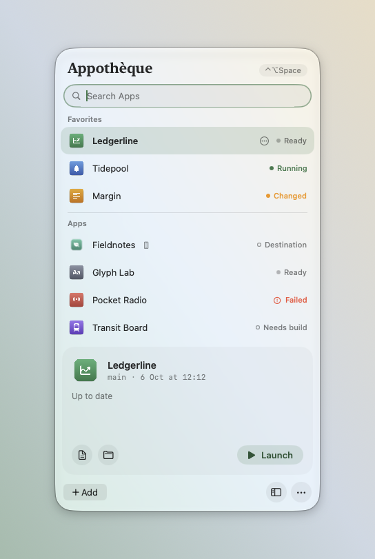
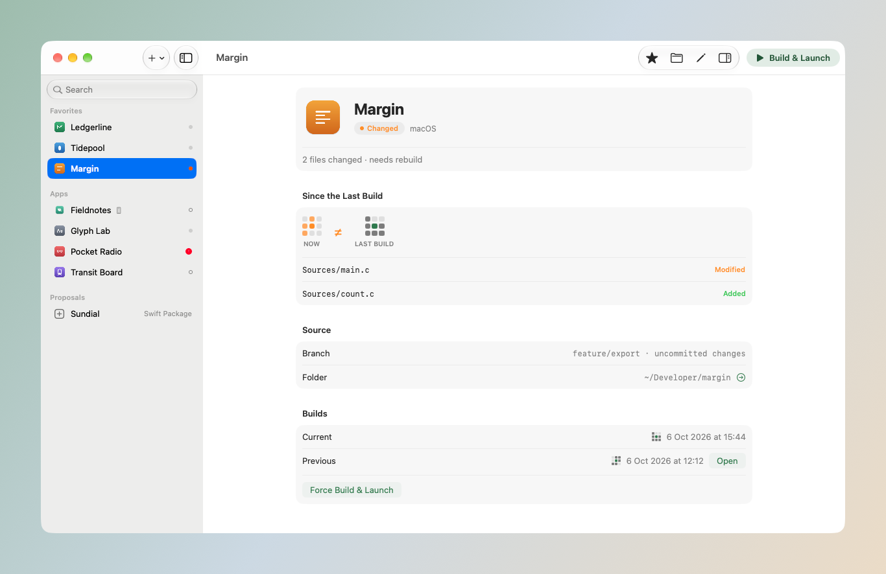

<p align="center">
  
</p>

<h1 align="center">Appothèque</h1>

<p align="center">
  A menu bar launcher for the Mac and iOS apps you are building.<br>
  Click an app: Appothèque checks your local files, builds only if something changed, then opens it.
</p>

<p align="center">
  macOS 26 or later · Swift, no dependencies · MIT license
</p>

<p align="center">
  <a href="docs/media/appotheque-film.mp4"></a><br>
  <a href="docs/media/appotheque-film.mp4">Watch the 35-second film</a>
</p>

<p align="center">
  
</p>

## What it does

When you work on several apps at once, opening the current version of one usually means opening Xcode or a terminal, picking the scheme, building and waiting. Appothèque keeps a build recipe for each project and a fingerprint of its inputs. If nothing changed since the last successful build, the app opens immediately; otherwise it is rebuilt first. Xcode and the terminal can stay closed.

- **Builds only when needed.** Tracked files, untracked files that Git does not ignore, uncommitted changes, lockfiles, the recipe and the selected Xcode all count. The first launch always builds, because an existing binary cannot be proven to match the sources.
- **Shows what changed.** The window lists the files modified, added or removed since the last successful build, next to the fingerprint of each build.
- **Keeps the previous build.** Each successful build is stored separately. The previous one stays one click away, including after a failed build.
- **Never force-quits.** When a newer build is ready, the running version is asked to quit normally, so its save dialogs still appear.
- **Finds your projects.** Xcode, XcodeGen, Swift Package, Tauri and Electron manifests are read without running any script. Nothing is added or built until you review and save the proposed recipe.
- **iOS and iPadOS.** Pick a simulator or a paired device once; Appothèque builds for it, boots the simulator, installs and launches the app.
- **Keyboard first.** ⌃⌥Space opens the launcher with the search field focused; arrows and Return launch.

<p align="center">
  
</p>

## Requirements

- macOS 26 or later.
- The toolchains your projects already use: Xcode for Xcode and Swift projects, and whatever else a recipe calls (XcodeGen, Node, Rust…).

## Install

With [Homebrew](https://brew.sh):

```sh
brew install --cask arsis-dev/tap/appotheque
```

Or download `Appotheque-<version>.zip` from the [latest release](https://github.com/arsis-dev/appotheque/releases/latest), unzip it and move `Appothèque.app` to your Applications folder. Releases are universal (Apple silicon and Intel), signed with a Developer ID and notarized by Apple.

To build from source with Xcode installed:

```sh
git clone https://github.com/arsis-dev/appotheque.git
cd appotheque
bash build.sh
cp -R "dist/Appothèque.app" ~/Applications/
open ~/Applications/Appothèque.app
```

`build.sh` produces an ad hoc signed bundle for local use.

## Getting started

1. Click the Appothèque icon in the menu bar, then **Discover My Projects**. The folders searched by default are those that exist among `~/Developer`, `~/Dev`, `~/Projects`, `~/Code`, `~/src` and `~/GitHub`; change them in **Settings → General**.
2. In the window, select a proposal and click **Configure…**. Check the build command and the path of the built app, then **Save**.
3. Click the app in the launcher. The first launch builds it; the next ones open it directly while the code is unchanged.

Apps can also be added by hand with **Add → Add Manually…**: a name, a folder, a build command that produces the `.app` without opening it, and the path of that `.app`.

The [user guide](docs/guide.md) covers the launcher, the window, settings, discovery, iOS and previous builds in detail.

## When a build is needed

Appothèque stores a SHA-256 fingerprint of a project's inputs with each successful build, along with a digest of each file so that it can list what changed. File contents are never stored.

- In a standalone Git repository, it reads tracked files and untracked files that are not ignored. Elsewhere, it walks the folder.
- Build outputs (`.build`, `build`, `dist`, `target`, `DerivedData`, `.app` bundles), `node_modules`, Python environments and common caches are ignored. Downloaded dependencies are represented by their lockfiles.
- `.env` files at the root are fingerprinted; their content is never written to logs.
- The selected Xcode and its version are part of the fingerprint. Replacing another tool that changes no project file (Node, Rust…) calls for **Force Build & Launch**.
- Files are checked again after the build. If they changed during it, the build is not recorded as current and the next launch rebuilds.
- Local dependencies outside the project, or ignored files that the build reads, go in the recipe's **Other Paths to Watch**.

## What Appothèque runs

- The build command of a recipe you saved, in the project folder, through your login shell (`zsh -l`) so that the same tools are found as in your terminal.
- For iOS: `xcodebuild`, `simctl` and `devicectl` through `xcrun`.

It does not:

- run anything during discovery;
- switch branches, pull or otherwise change your repositories;
- force-quit an app;
- change signing, accounts, pairing or Developer Mode on your devices;
- make network requests of its own.

Build logs contain the output of your build tools. Read a log before sharing it.

## Where data lives

In `~/Library/Application Support/Appotheque/`:

| Path | Content |
|---|---|
| `projects.json` | Recipes, editable from the app. |
| `Receipts/` | Fingerprints of the last successful builds. |
| `Failures/` | The last failed build of each project, until a build succeeds. |
| `Builds/` | Separate copies of the built apps: the last two generations, plus any generation still running. |
| `Logs/` | The last build log of each project. |
| `Mobile/` | iOS builds, receipts and logs, per destination. |

Preferences (favorites, order, hidden apps, shortcut, appearance, destinations) are stored in the `dev.arsis.appotheque` defaults domain. Removing a project from the list keeps its sources and builds.

## Limitations

- macOS 26 or later only: the interface relies on the system's Liquid Glass materials.
- With Xcode 27, simulator windows are opened through Device Hub's `devices://device/open` link handler, which Apple does not document. A future Xcode may require an update.
- Proposed recipes are a starting point. Projects with helper executables, special permissions or custom build steps may need adjustments.
- Electron projects without a packaging tool are assembled from the Electron copy in `node_modules`, which produces an app of about 300 MB.
- Web-only projects are not native apps and cannot be launched.

## Development

```sh
swift test
bash build.sh
open "dist/Appothèque.app"
```

The tests use real files and processes in temporary folders: rebuild decisions, uncommitted and untracked files, lockfiles, failures, changes during a build, previous builds, discovery, iOS inventories and destinations.

An optional integration test builds a temporary SwiftUI app with XcodeGen, installs it in the simulator you name, relaunches it without building, changes its sources and checks the rebuild:

```sh
APPOTHEQUE_SMOKE_SIMULATOR='<simulator UDID>' swift test --filter MobileSimulatorIntegrationTests
```

It only uses that simulator and removes its app afterwards. Use a simulator reserved for testing.

### Localization

Interface strings are written in English in the code. Translations live in `Resources/Localizable.xcstrings`, which `build.sh` compiles into the app. When you add a visible string, add its entry to the catalog. To try a language without changing your Mac's:

```sh
open "dist/Appothèque.app" --args -AppleLanguages '(fr)'
```

### Releasing

`scripts/release.sh` builds a universal app (Apple silicon and Intel), signs it with a Developer ID certificate and the hardened runtime, notarizes it, staples the ticket and writes `dist/Appotheque-<version>.zip` with its SHA-256. The script header lists where it looks for the signing identity and the notarization credentials. `scripts/release.sh --skip-notarize` only signs, to try the build locally. The Homebrew cask is kept in `packaging/homebrew/appotheque.rb`.

### Film

The film is a canvas animation in `media/launch-film/`, rendered frame by frame with Playwright and assembled with ffmpeg. The sound is synthesized by `audio.py` with the Python standard library.

```sh
cd media/launch-film
npm install && npx playwright install chromium-headless-shell
node render.mjs stills 4 10 16       # a few frames and a contact sheet, in stills/
OUT=out/final node render.mjs full   # the silent video, in out/final/
python3 audio.py out/final           # the soundtrack
POSTER_T=34 ./finish.sh out/final    # the film with sound, the poster and the README loop
```

`film.html` takes `?app=` and `?ios=` to pick the demo apps (Daily Monitor and LoopHuntr by default), and the reading pauses are listed in `HOLDS`.

## License

MIT. See [LICENSE](LICENSE).
